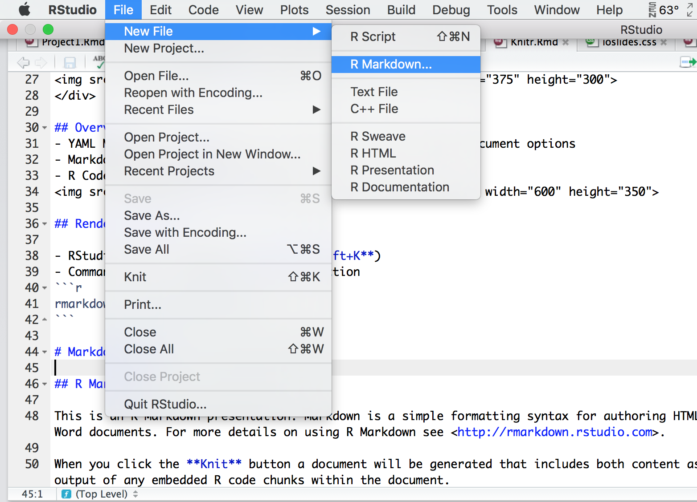
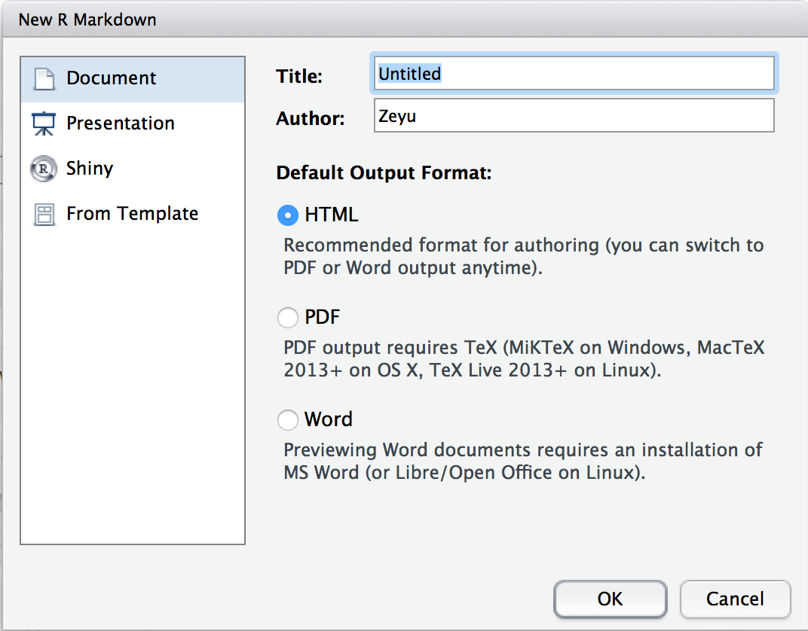
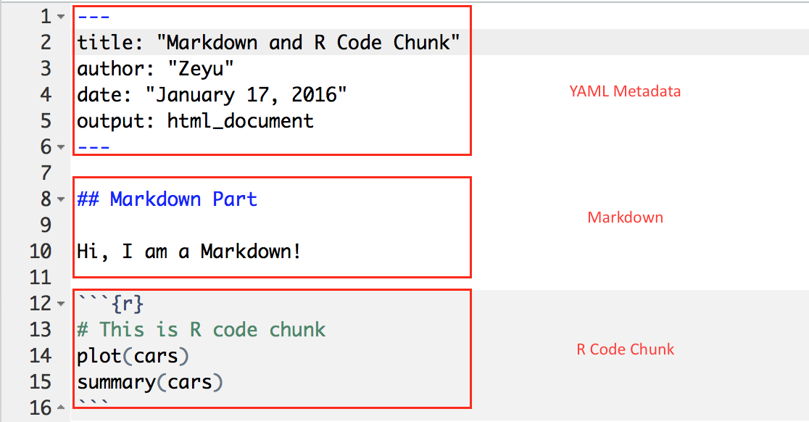
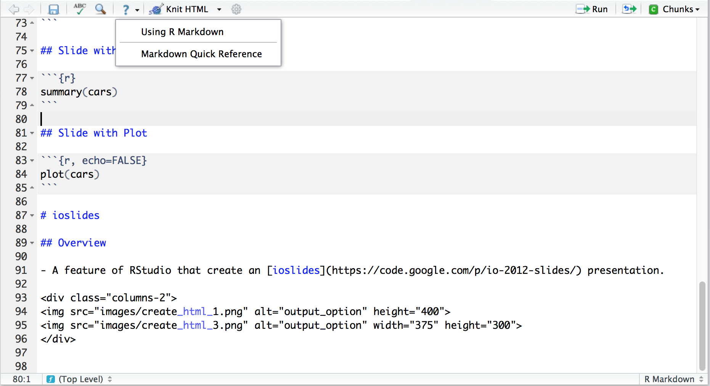
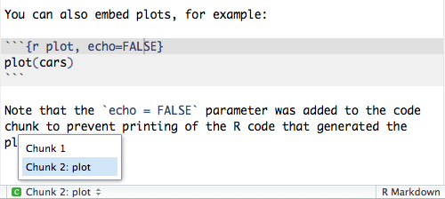
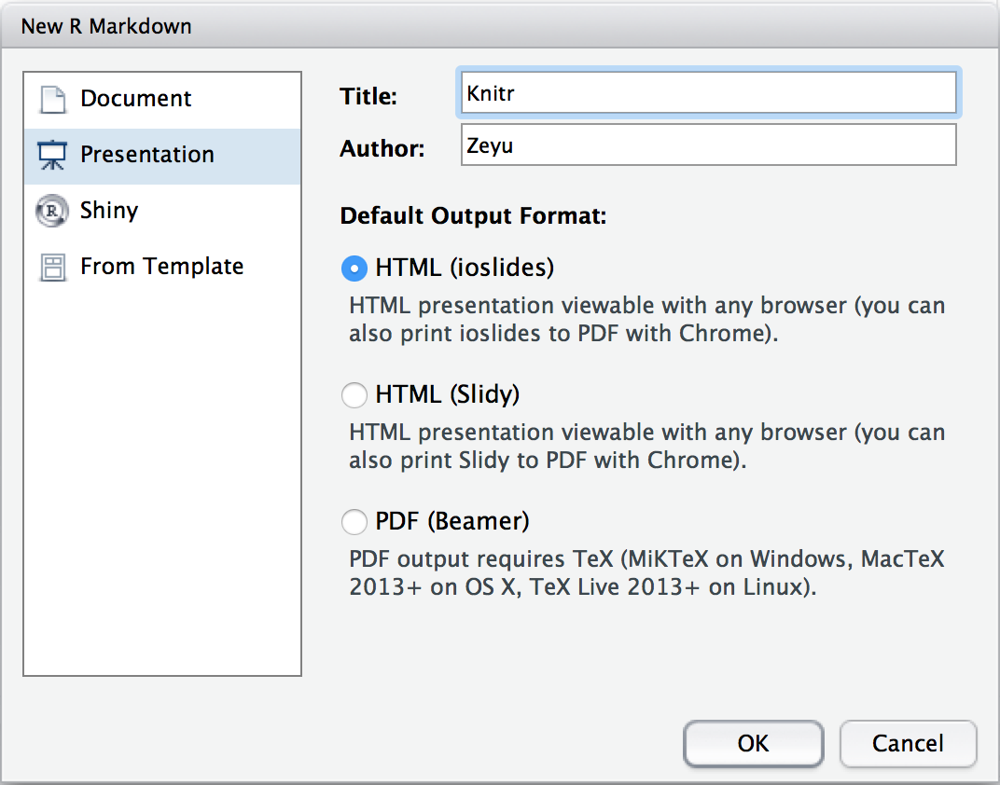
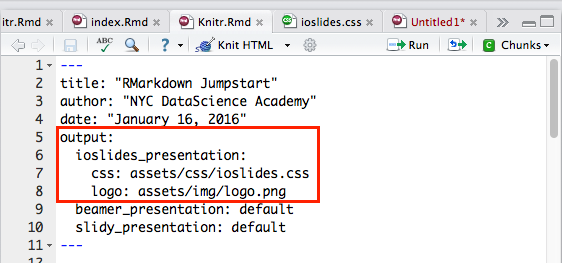

## Outline

- HTML Documents
- Markdown Basics
- R Code Chunks
- ioslides


# HTML Documents

## Create a HTML Document

<div class="columns-2">


</div>

## Overview
- YAML Metadata: [YAML](http://en.wikipedia.org/wiki/YAML) document options
- Markdown: Article text
- R Code Chunk: Executible R code


## Rendering Output

- RStudio: "Knit" command (**Command+Shift+K**)
- Command line: `rmarkdown::render` function
```r
rmarkdown::render("input.Rmd")
```

# Markdown Basics

## Markdown Quick Reference



- For more details on using R Markdown see <http://rmarkdown.rstudio.com>.


## Emphasis
```markdown
*italic*   **bold**

_italic_   __bold__
```

*I am italic*   

**I am bold**

## Headers

```markdown
# Header 1

## Header 2

### Header 3
```

<h2> Header 1 </h2>
<h3> Header 2 </h3>
<h1> Header 3 </h1>

## Lists {.columns-2}
```html
Unordered List:
* Item 1
* Item 2
    + Item 2a
    + Item 2b
    
Ordered List:
1. Item 1
2. Item 2
3. Item 3
    + Item 3a
    + Item 3b
```
```
Unordered List:
* Item 1
* Item 2
    + Item 2a
    + Item 2b
    
Ordered List:
1. Item 1
2. Item 2
3. Item 3
    + Item 3a
    + Item 3b
```

## Links

A plain http address or add a link to a phrase.

**Inline Link:**

```html
[The link of NYC Datascience Academy](http://nycdatascience.com/)
```
[The link of NYC Datascience Academy](http://nycdatascience.com/)

**Reference Link**:

```html
[The link of your blog post][blog]

[blog]: http://blog.nycdatascience.com/
```

[The link of your blog post][blog]

[blog]: http://blog.nycdatascience.com/


# R Code Chunks

## Overview

R code will be evaluated and printed

<pre class="markdown"><code>&#96;&#96;&#96;{r}
summary(cars$dist)
&#96;&#96;&#96;
</code></pre>


```{r}
summary(cars$dist)
```

## Named R code chunk. 

<pre class="markdown"><code>&#96;&#96;&#96;{r plot, echo=FALSE}
summary(cars)
plot(cars)
&#96;&#96;&#96;
</code></pre>

- Easy Navigation in RStudio  

    


## Basic Chunk Options

- `echo`(TRUE): whether to include R source code in the output file
- `eval`(TRUE): whether to evaluate the code chunk
- `message`(TRUE): whether to preserve messages emitted by message()
- `include`(TRUE): if include=FALSE, nothing will be written into the output document, but the code is still evaluated and plot files are generated
- `warning`(TRUE): whether to preserve warnings in the output 

## Inline R Code


<br>

```r
I counted `r 1+1` red trucks on the highway.
```


## Plots

- `dev`('png'): figure format(png, jpeg, tiff, svg, ...)
- `fig.path`('figure/'): figure path
- `fig.width`(7): figure width
- `fig.height`(7): figure height

<pre class="markdown"><code>&#96;&#96;&#96;{r dev='svg', fig.path='myplot', fig.height=8}
plot(iris)
&#96;&#96;&#96;
</code></pre>

## Plots

```{r, echo=FALSE}
plot(iris)
```


# ioslides

## Overview

- A feature of RStudio that create an [ioslides](https://code.google.com/p/io-2012-slides/) presentation.

<div class="columns-2">


</div>

## Create an ioslides
- The output of rmarkdown file is different from the html one.



## Section

- `#`: create a section
- `##`: create a new slide
- `---`: create a new slide without a header(horizontal rule)
- `|`: add a subtitle


```yaml
# section

## slide 1

---

## slide 2 | with subtitle
```

## Adding a Logo

Add a customized logo:

```yaml
---
output:
  ioslides_presentation:
    logo: logo.png
---
```

## R code chunks

<pre class="markdown"><code>&#96;&#96;&#96;{r, echo=FALSE}
summary(cars)
&#96;&#96;&#96;
</code></pre>

```{r echo=FALSE}
summary(cars)
```


 