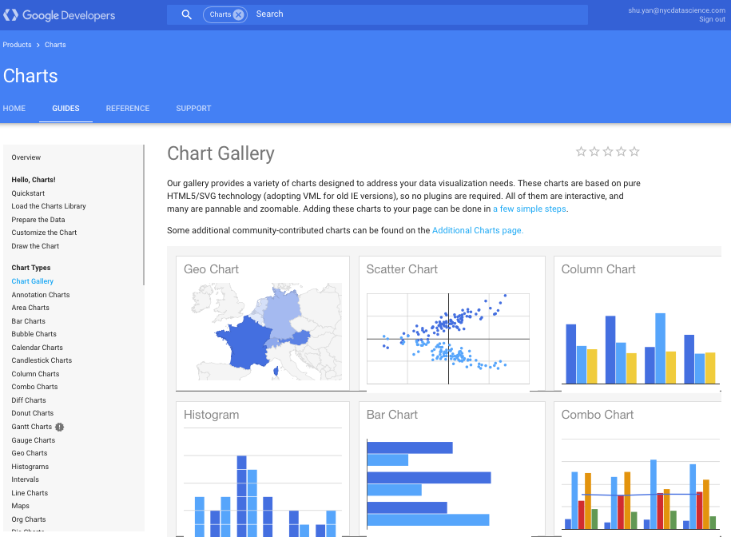
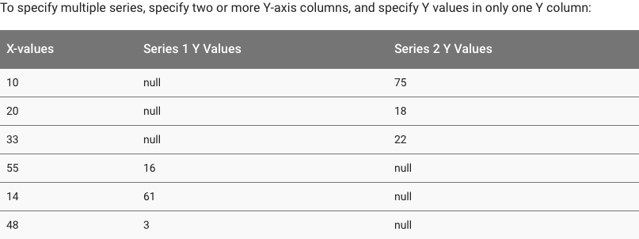
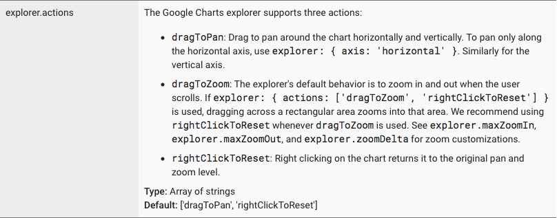
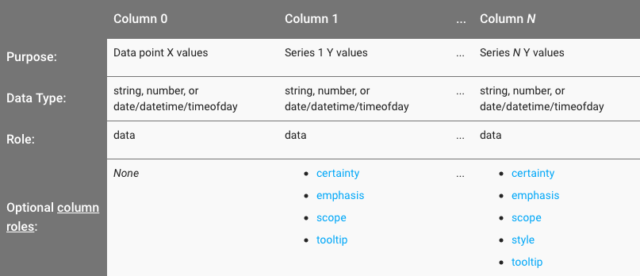
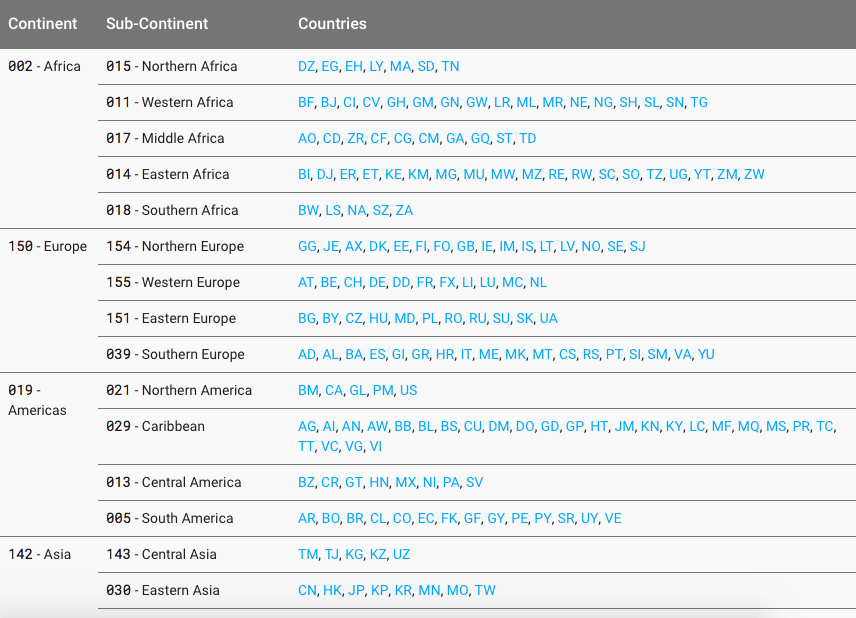

## GoogleVis API

https://developers.google.com/chart/interactive/docs/gallery



## Example

```{r, results="asis", echo=FALSE}
suppressWarnings(suppressPackageStartupMessages(library(googleVis)))
M <- gvisMotionChart(Fruits, "Fruit", "Year",
                     options=list(width=600, height=400))
plot(M,"chart")
```


## Charts in googleVis

https://cran.r-project.org/web/packages/googleVis/googleVis.pdf

* Line chart: `gvisLineChart`
* Column chart: `gvisColumnChart`
* Combo chart: `gvisComboChart`
* Scatter chart: `gvisScatterChart`
* Bubble chart: `gvisBubbleChart`
* Geo Chart: `givsGeoChart`
* Table: `gvisTable`

and more...

## Library and Demo

```{r, eval=FALSE}
## Install the package if you haven't 
# install.packages("googleVis")
library(googleVis)
demo(googleVis)
```

## A Simple Example

```{r}
head(mtcars, n = 10)
```

## A Simple Example

```{r, results='asis'}
scatter <- gvisScatterChart(mtcars[,c("wt", "mpg")])
plot(scatter,"chart")
```

## How it Works

* The R function creates an HTML page
* The HTML page calls Google Charts
* The result is an interactive HTML graphic


## HTML Output

```{r}
print(scatter)
```

## Data Format

https://developers.google.com/chart/interactive/docs/gallery/scatterchart#data-format




## Data Format

```{r}
dt <- mtcars[,c("wt", "mpg")]
dt$cyl_4 <- ifelse(mtcars$cyl==4, dt$mpg, NA)
dt$cyl_6 <- ifelse(mtcars$cyl==6, dt$mpg, NA)
dt$cyl_8 <- ifelse(mtcars$cyl==8, dt$mpg, NA)
dt$mpg <- NULL
head(dt)
```


## Data Format

```{r, results='asis'}
scatter <- gvisScatterChart(dt)
plot(scatter,"chart")
```


## Setting Options

The parameters can be set via a named list.

```{r, results='asis'}
my_options <- list(width="600px", height="300px",
                   title="Motor Trend Car Road Tests",
                   hAxis="{title:'Weight (1000 lbs)'}",
                   vAxis="{title:'Miles/(US) gallon'}")
plot(gvisScatterChart(dt,options=my_options),"chart")
```


## Setting Options

The parameters have to map those of the [Google documentation](https://developers.google.com/chart/interactive/docs/gallery/scatterchart#Configuration_Options). For example:



explorer:{actions:['dragToZoom', 'rightClickToReset']}:
```{r}
explorer="{actions:['dragToZoom', 'rightClickToReset']}"
```


## Setting Options

```{r, results='asis', fig.height=8}
my_options$explorer <- "{actions:['dragToZoom', 'rightClickToReset']}"
plot(gvisScatterChart(dt,options=my_options), "chart")
```


## Optional Column Roles



https://developers.google.com/chart/interactive/docs/roles#tooltiprole


## Setting Tooltips

```{r}
dt <- mtcars[,c("wt", "mpg")]
dt$cyl_4 <- ifelse(mtcars$cyl==4, dt$mpg, NA)
dt$cyl_4.html.tooltip <- rownames(dt)
dt$cyl_6 <- ifelse(mtcars$cyl==6, dt$mpg, NA)
dt$cyl_6.html.tooltip <- rownames(dt)
dt$cyl_8 <- ifelse(mtcars$cyl==8, dt$mpg, NA)
dt$cyl_8.html.tooltip <- rownames(dt)
dt$mpg <- NULL
head(dt)
```


## Setting Tooltips

```{r, results='asis'}
plot(gvisScatterChart(dt,options=my_options), "chart")
```


## GeoCharts

```{r}
gdp <- read.csv("./data/global_gdp.csv")
gdp$X2014 <- round(gdp$X2014/1e9, digits = 3)
names(gdp) <- c("Country", "GDP")
head(gdp)
```


## GeoCharts

```{r, results='asis'}
plot(gvisGeoChart(gdp, "Country", "GDP",
                  options=list(projection="kavrayskiy-vii")), "chart")
```


## GeoCharts

https://developers.google.com/chart/interactive/docs/gallery/geochart?hl=en#continent-hierarchy-and-codes



## GeoCharts

Plot only Europe `region=150`

```{r, results='asis'}
plot(gvisGeoChart(gdp, "Country", "GDP", 
                  options=list(region=150, height=300)), "chart")
```


## GeoCharts

```{r}
emissions <- read.csv("./data/state_emissions.csv")
head(emissions[,c("State", "Absolute")], n = 5)
state_em <- gvisGeoChart(emissions, "State", "Absolute", 
                         options=list(region="US", 
                                    displayMode="regions", 
                                    resolution="provinces",
              colorAxis="{colors: ['green', 'white', 'red']}"))
```


## GeoCharts

```{r, results='asis'}
plot(state_em, "chart")
```

If your data involves County level data, use [leaflet](http://rstudio.github.io/leaflet/) instead.

## Other javascript/D3 Libraries

* [leaflet](http://rstudio.github.io/leaflet/) - Geo-spatial mapping
* [dygraphs](http://rstudio.github.io/dygraphs/) - Time series charting
* [networkD3](http://christophergandrud.github.io/networkD3/) - Graph data visualization with D3
* [rCharts](http://rcharts.io) - Multiple JavaScript charting libraries

