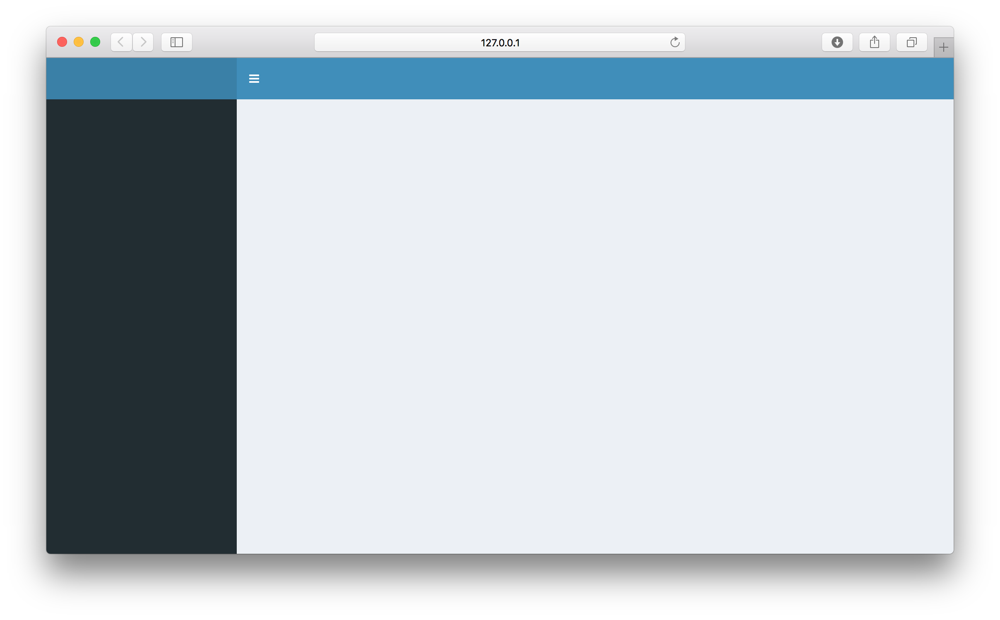
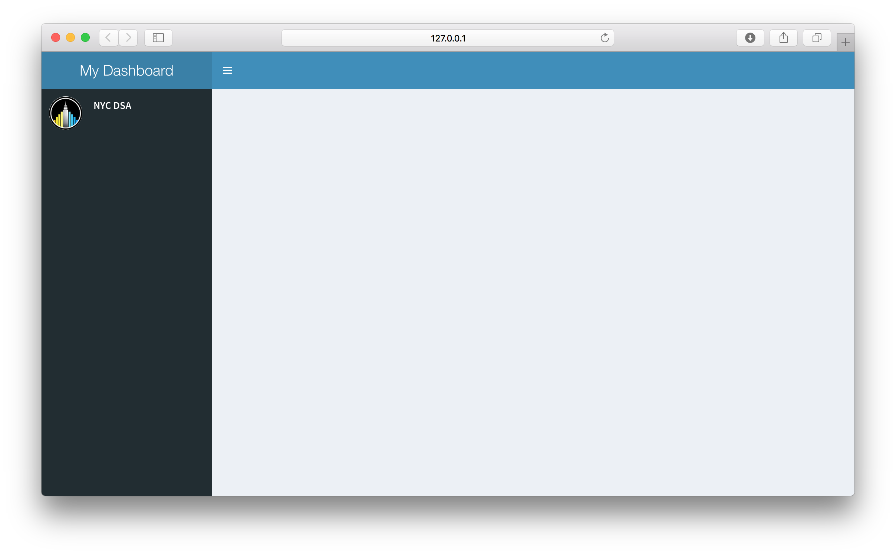
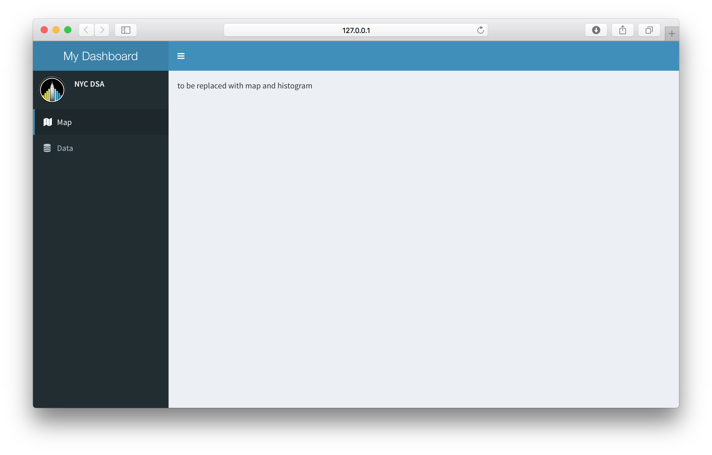
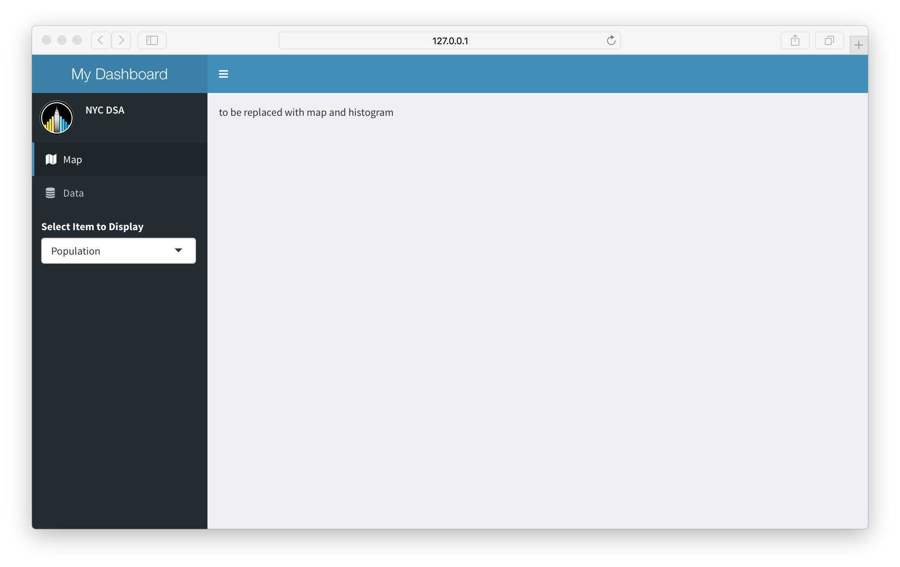
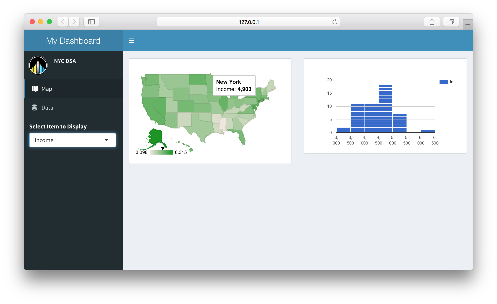
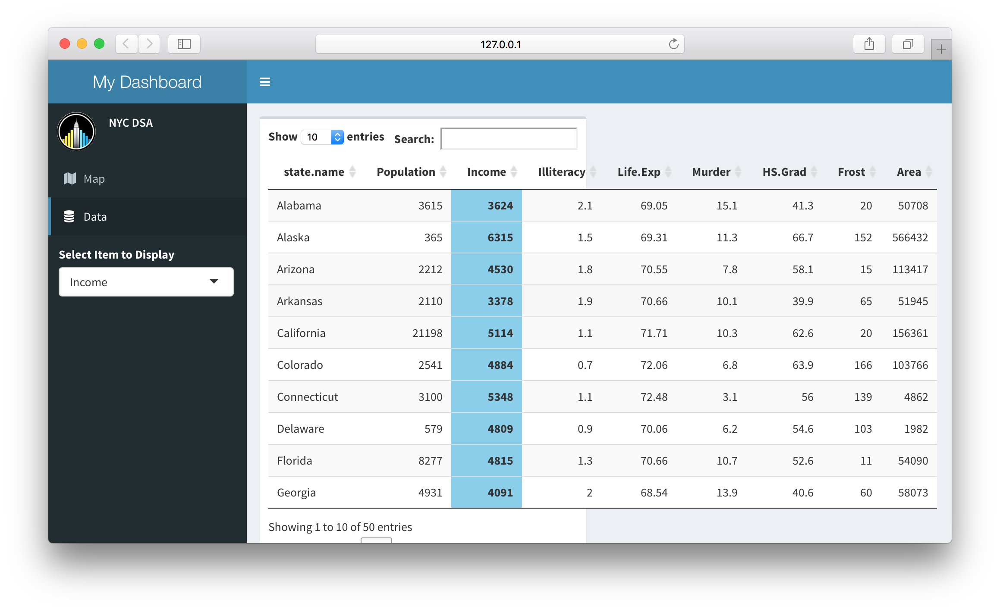
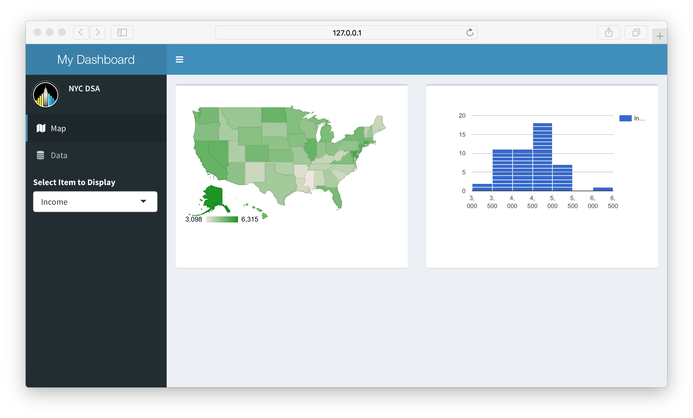
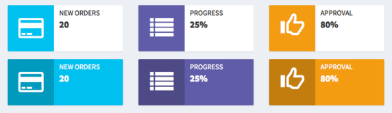
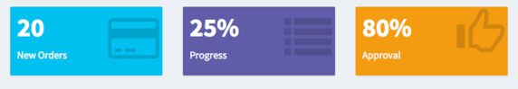
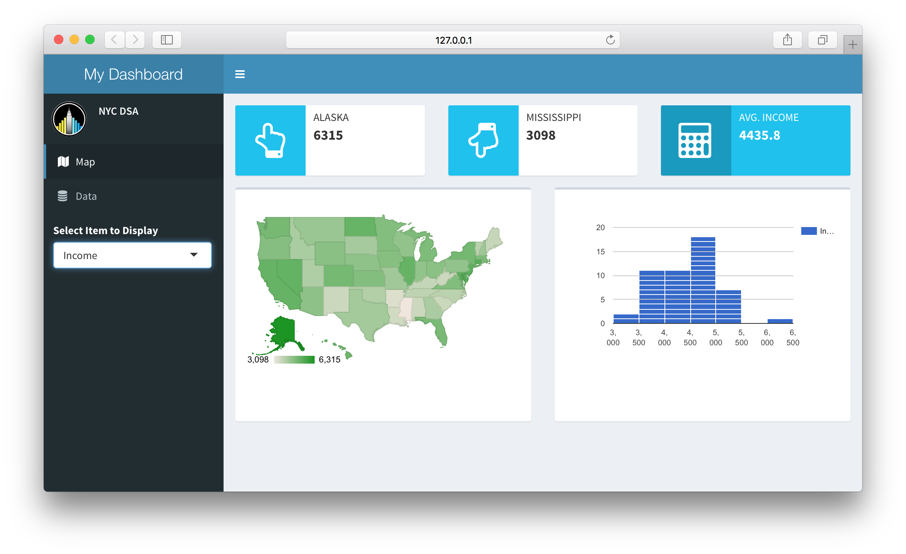

```{r setup, include=FALSE}
knitr::opts_chunk$set(eval = FALSE)
```


## Dashboard UI Design


## `shinydashboard` Installation

```{r}
install.packages("shinydashboard") 
```

See the documentation at http://rstudio.github.io/shinydashboard/ for more information

## shinydashboard Layout

A dashboard has three parts: a header, a sidebar, and a body.

```{r}
## ui.R ##
library(shinydashboard)

shinyUI(dashboardPage(
  dashboardHeader(),
  dashboardSidebar(),
  dashboardBody()
))
```

```{r, eval=FALSE}
## server.R ##
shinyServer(function(input, output){
})
```


## shinydashboard Layout




## Header

Setting the title is simple, just use the `title` argument in `dashboardHeader`:

```{r}
## ui.R ##
dashboardHeader(title = "My Dashboard")
```

(Note: Besides header, we can also set three types of menus – messages, notifications, and tasks - in header)

## Adding Personal Information in Sidebar

We can also add personal info easily with `siderbarUserPanel` inside `dashboardSidebar`:

```{r}
## ui.R ##
dashboardSidebar(
  sidebarUserPanel("Your Name",
                   image = <link to Your Photo>)
)
```


## Adding Header and Personal Info




## Dataset - **state.x77**

Matrix with 50 rows and 8 columns giving the following statistics in the respective columns.

+ **Population**: population estimate as of July 1, 1975
+ **Income**: per capita income (1974)
+ **Illiteracy**: illiteracy (1970, percent of population)
+ **Life Exp**: life expectancy in years (1969–71)
+ **Murder**: murder and non-negligent manslaughter rate per 100,000 population (1976)
+ **HS Grad**: percent high-school graduates (1970)
+ **Frost**: mean number of days with minimum temperature below freezing (1931–1960) in capital or large city
+ **Area**: land area in square miles
    

## Dataset

```{r, eval=TRUE, echo=FALSE}
## data.frame
head(state.x77)
```


## Using global.R (Data preparation)

Objects defined in **global.R** are loaded into the global environment and are available to both **server.R** and **ui.R**.

```{r, eval=FALSE}
## global.R ##

# convert matrix to dataframe
state_stat <- data.frame(state.name = rownames(state.x77), state.x77)
# remove row names
rownames(state_stat) <- NULL
# create variable with colnames as choice
choice <- colnames(state_stat)[-1]
```


## Goals

We want to:

- allow user to select differet columns using `selectizeInput()`;
- visualize the column using `gvisGeoChart()` and `gvisHistogram()`;
- display full dataset using `datatable` and highlight the selected column.


## Sidebar menu items and tabs

Hmmm... too much for one page, let's split them into two tabs.

* Similar to `tabPanels` from Shiny, in `shinydashboard` we can create `menuItem` and `tabItem`. 

* To match up a `menuItem` with a `tabItem`, make sure that they have matching values for `tabName`.

* When users click on one of the `menuItems` in the sideBar, it will display different content (`tabItem`) in the body of the dashboard.


## Sidebar menu items and tabs

The menu items are put in `sidebarMenu()` as follows:

```{r, eval=FALSE}
## ui.R ##
dashboardSidebar(
    sidebarUserPanel("Your Name", image = <link to Your Photo>),
    sidebarMenu(
        menuItem("Map", tabName = "map", icon = icon("map")),
        menuItem("Data", tabName = "data", icon = icon("database")))
)
dashboardBody(
    tabItems(
        tabItem(tabName = "map",
                "to be replaced with map and histogram"),
        tabItem(tabName = "data",
                "to be replaced with datatable"))
)
```


## Sidebar menu items and tabs




## Adding Input Widget

Since we want user to be able to choose which column to visualize, we can insert a `selectizeInput()` inside `dashboardSidebar()`.

```{r}
## ui.R ##
dashboardSidebar(
    ... ... 
    selectizeInput("selected",
                   "Select Item to Display",
                   choice)
)

```


## Adding Input Widget




## Building Reactive Outputs

Time to give your Shiny app a “live” quality! 

The object will be reactive if the code calls `input$selected`.

Remeber we want to:

* build a map using `gvisGeoChart()` 
    * `renderGvis()` -> `htmlOutput()`
* build a histogram using `gvisHistogram()` 
    * `renderGvis()` -> `htmlOutput()`
* display full dataset using `datatable()`
    * `DT::renderDataTable()` -> `DT::dataTableOutput()`


## Building Reactive Outputs in `server.R`

Now let's build the render part in `server.R`. 

* map and histogram
```{r}
## server.R ##
# show map using googleVis
output$map <- renderGvis({
    gvisGeoChart(state_stat, "state.name", input$selected,
                 options=list(region="US", displayMode="regions", 
                              resolution="provinces",
                              width="auto", height="auto"))
                # using width="auto" and height="auto" to
                # automatically adjust the map size
})
# show histogram using googleVis
output$hist <- renderGvis(
    gvisHistogram(state_stat[,input$selected, drop=FALSE]))
```


## Building Reactive Outputs in `server.R`

* datatable

```{r}
## server.R ##
# show data using DataTable
output$table <- DT::renderDataTable({
    datatable(state_stat, rownames=FALSE) %>% 
        formatStyle(input$selected,  
                    background="skyblue", fontWeight='bold')
        # Highlight selected column using formatStyle
})
```

The datatable documentation can be found via: https://rstudio.github.io/DT/

## Adding Reactive Outputs to **Boxes** in `ui.R`

**Boxes** are the main building blocks of dashboard pages. 

A basic box can be created with the `box()` function, and the contents of the box can be (most) any Shiny UI content.

In a typical dashboard, these boxes would be placed inside a `fluidRow()`.


## Adding Reactive Outputs to **Boxes** in `ui.R`

```{r}
## ui.R ##
dashboardBody(
    tabItems(
        tabItem(tabName = "map",
                         # gvisGeoChart
                fluidRow(box(htmlOutput("map")),
                         # gvisHistoGram
                         box(htmlOutput("hist")))),
        tabItem(tabName = "data",
                         # datatable
                fluidRow(box(DT::dataTableOutput("table"))))
))
```


## Reactive Output Map Tab




## Reactive Output Data Tab




## Modifying the sizes of the boxes

* In the Map tab, we may want the two boxes to have the same height.
* In the Data tab, we may want the box that contains datatable to cover entire body width.

```{r}
## ui.R ##
dashboardBody(
    tabItems(
        tabItem(tabName = "map",
                fluidRow(box(htmlOutput("map"), 
                             height = 300),
                         box(htmlOutput("hist"), 
                             height = 300))),
        tabItem(tabName = "data",
                fluidRow(box(DT::dataTableOutput("table"), 
                             width = 12)))))
```


## Reactive Output Map Tab




## Reactive Output Data Tab


## infoBox and valueBox

**infoBox** and **valueBox** can be used for displaying simple numeric or text values, with an [icon](http://fontawesome.io/icons/). Here are some examples:

* **infoBox**



* **valueBox**




## Building infoBox

To build an reactive infoBox object is similar to other reactive object:

* use `infoBox()` and `renderInfoBox()` in `server.R` 
* use `infoBoxOutput()` in `ui.R`

Now let's build three `infoBox`es to display the following descriptive statistics of the selected column:

* state that has the highest value
* state that has the lowest value
* average value


## Building infoBox in `server.R`

```{r}
# show statistics using infoBox
output$maxBox <- renderInfoBox({
    max_value <- max(state_stat[,input$selected])
    max_state <- 
        state_stat$state.name[state_stat[,input$selected]==max_value]
    infoBox(max_state, max_value, icon = icon("hand-o-up"))
})
output$minBox <- renderInfoBox({
    min_value <- min(state_stat[,input$selected])
    min_state <- 
        state_stat$state.name[state_stat[,input$selected]==min_value]
    infoBox(min_state, min_value, icon = icon("hand-o-down"))
})
output$avgBox <- renderInfoBox(
    infoBox(paste("AVG.", input$selected),
            mean(state_stat[,input$selected]), 
            icon = icon("calculator"), fill = TRUE))
```


## Building infoBox in `ui.R`

Now let's place the three infoBox above the map and histogram.

The first tabItem then becomes:

```{r}
## ui.R ##
tabItem(tabName = "map",
        fluidRow(infoBoxOutput("maxBox"),
                 infoBoxOutput("minBox"),
                 infoBoxOutput("avgBox")),
        fluidRow(box(htmlOutput("map"), height = 300),
                 box(htmlOutput("hist"), height = 300)))
```


## Building infoBox



